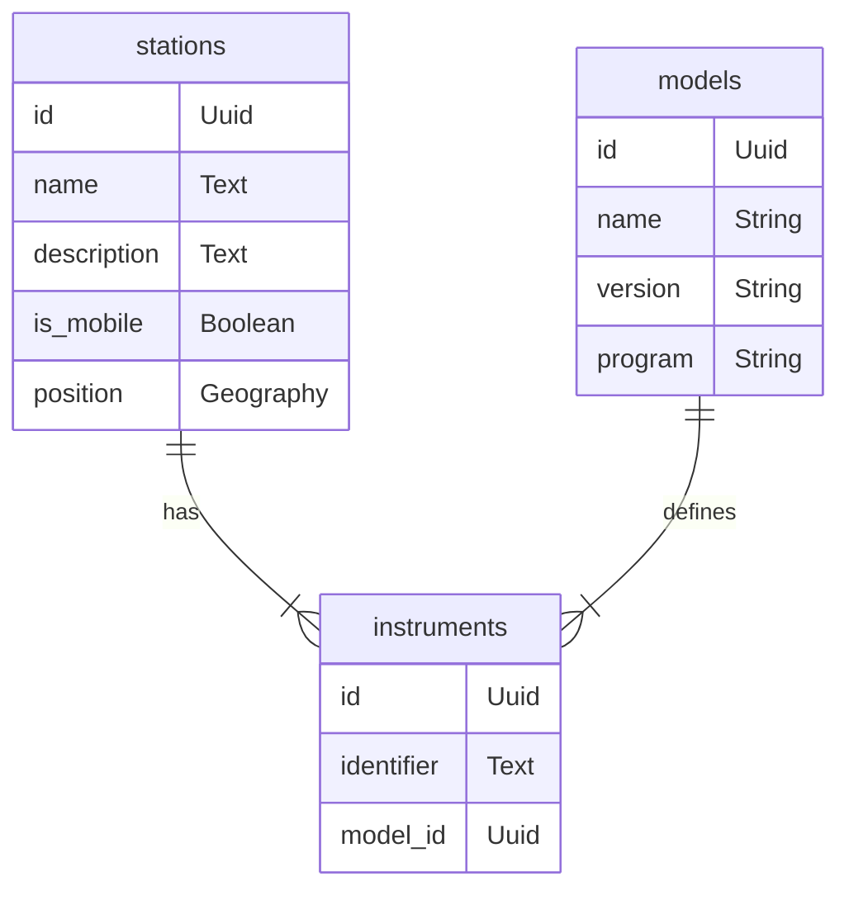

# Database

## Schema

```mermaid

erDiagram

stations {
  id Uuid
  name Text
  description Text
  is_mobile Boolean
  position Geography
}

instruments {
  id Uuid
  identifier Text
  model_id Uuid
}

models {
  id Uuid
  name String
  version String
  program String
}

stations ||--|{ instruments : has
models ||--|{ instruments : defines
```
