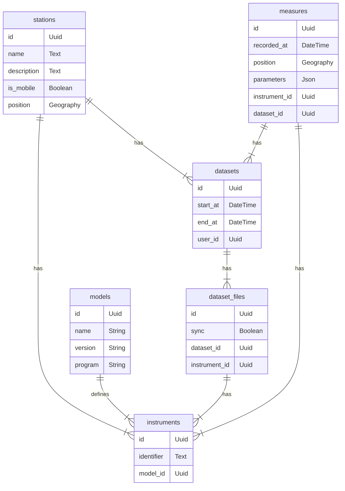

# Database

## Schema

```mermaid

erDiagram

stations {
  id Uuid
  name Text
  description Text
  is_mobile Boolean
  position Geography
}

instruments {
  id Uuid
  identifier Text
  model_id Uuid
}

models {
  id Uuid
  name String
  version String
  program String
}

datasets {
  id Uuid
  start_at DateTime
  end_at DateTime
  user_id Uuid
}

dataset_files {
  id Uuid
  sync Boolean
  dataset_id Uuid
  instrument_id Uuid
}

measures {
  id Uuid
  recorded_at DateTime
  position Geography
  parameters Json
  instrument_id Uuid
  dataset_id Uuid
}

stations ||--|{ instruments : has
models ||--|{ instruments : defines
stations ||--|{ datasets : has
datasets ||--|{ dataset_files : has
dataset_files ||--|{ instruments : has
measures ||--|{ datasets : has
measures ||--|{ instruments : has
```
