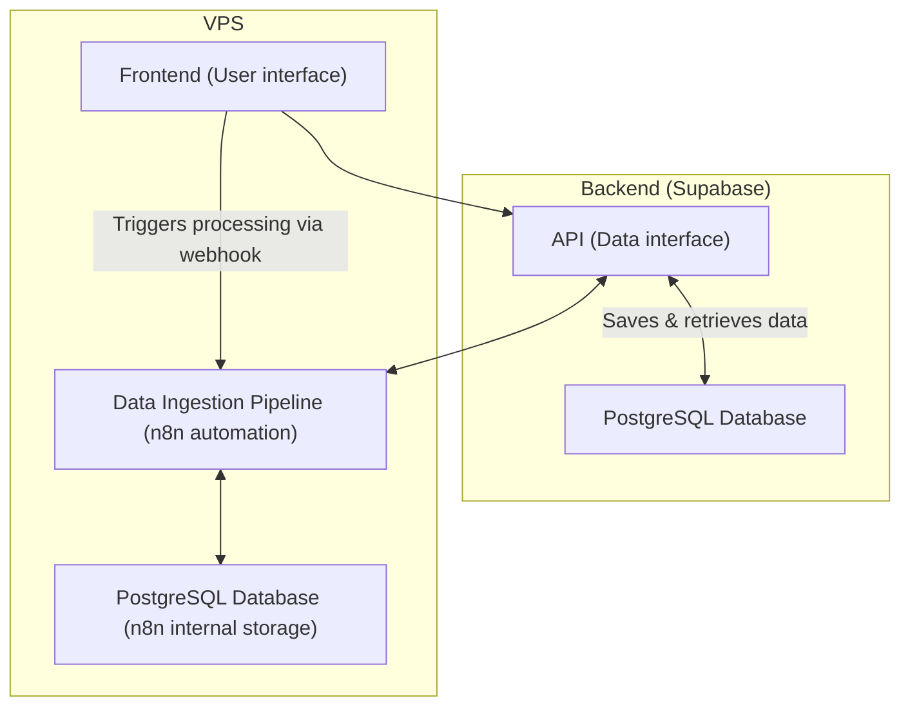

# Development Guide

This guide will help you understand how the Data Platform works behind the scenes and how you can contribute to its development, even if you're new to software development.

## Architecture Overview

The application is made up of 3 main parts that work together:

### 1. **Frontend** (What users see and interact with)
- This is the visual part of the application that runs in the web browser
- Users can view data, upload files through this interface
- Built with React and TypeScript
- 📖 [Learn more about the frontend →](./frontend.md)

### 2. **Backend** (Where data is stored)
- This is the database and API that stores all the data
- Provides a secure way for the frontend to save and retrieve information
- Built with Supabase (includes PostgreSQL database)
- 📖 [Learn more about the backend →](./backend.md)

### 3. **Data Ingestion** (How data gets processed)
- This part automatically processes CSV files uploaded by contributors
- Extracts data from files, transforms it into the right format, and loads it into the database (ETL process)
- Built with n8n (a workflow automation tool)
- 📖 [Learn more about data ingestion →](./ingestion.md)

## How They Work Together

Here's a visual representation of how these parts communicate:

**What this diagram shows:**
- The **Frontend** communicates with the **Backend** to read and save data
- When a user uploads a file, the **Frontend** triggers the **Data Ingestion Pipeline**
- The **Data Ingestion Pipeline** processes the file and stores the results in the **Backend**
- Each component has its own database for managing information

## Getting Started

If you're ready to start developing:

1. **Understand the frontend** - Read the [frontend guide](./frontend.md) to learn about the user interface and how it's built
2. **Learn about data storage** - Check the [backend guide](./backend.md) to understand how data is stored and managed
3. **Explore data processing** - See the [data ingestion guide](./ingestion.md) to learn how CSV files are processed

Don't worry if some concepts seem complex at first – you'll learn as you go! Each guide breaks down the details in a beginner-friendly way.
